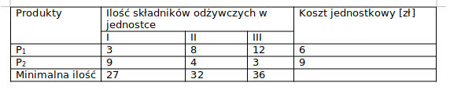

# LAB1
## Numer albumu: 66183

### Uruchamianie zadania: 
<pre>

W zalaczonym folderze o nazwie mojego albumu zawarty jest rowniez folder target z skompilowanym kodem i zapakowanym do pliku jar
Jesli nie chce Pan korzystac z wczesniej skompilowanego kodu, prosze przejsc do folderu o nazwie albumu (66183)
i skompilowac kod komenda:
    <b>mvn package</b>
    
nastepnie przejsc do folderu target gdzie bedzie zawarty plik 66183.zad1-1.0-jar-with-dependencies.jar

i uruchomic go za pomoca komendy:
    <b>java -jar 66183.zad1-1.0-jar-with-dependencies.jar</b>

</pre>

### Tresc zadania:
<pre>

Zadanie 1.	
Firma tworzy mieszankę do spożycia z dwóch produktów. 
Ma ona na celu dostarczyć pewnych składników odżywczych w ilości nie mniejszej niż określona na etykiecie. 

</pre>
###Dane:

### Model matematyczny:

<pre>

Okreslenie ograniczen:
    W I jednostce: 3&#215;P1 + 9&#215;P2 &#8925; 27
    W II jednostce: 8&#215;P1 + 4&#215;P2 &#8925; 32
    W III jednostce: 12&#215;P1 + 3&#215;P2 &#8925; 36
    
    Dodatkowo nalezy przyjac zalozenia 
        Dla Podpunktu 1:
            P1 &#62; 0
            P2 &#62; 0
        Dla podpunktu 2:
            P1 &#62; 0
            P2 &#62; 0
            P1 &#62; P2
    
    Funkcja celu:
        Z = 6&#215;P1 + 9&#215;P2 -> min
</pre>

### Tresc zadania optymalizacyjnego:

<pre>
 Podpunkt 1:
 Ile należy wykorzystać produktów P1 i P2, aby spełniając wymagania koszt wytworzenia mieszanki był jak najniższy?
  
    Rozwiazanie:
        P1 = 3
        P2 = 2
        Z(funkcja celu) = 36   (OPTIMAL 36.0 @ { 3, 2 })
  
  
 Podpunkt 2:
 Jak zmieni się rozwiązanie, jeśli ze względu na konsystencję produktu P1 musi być więcej niż P2?

    Rozwiazanie:
        P1 = 9
        P2 = 0
        Z(funkcja celu) = 54   (OPTIMAL 54.0 @ { 9, 0 }

</pre>

