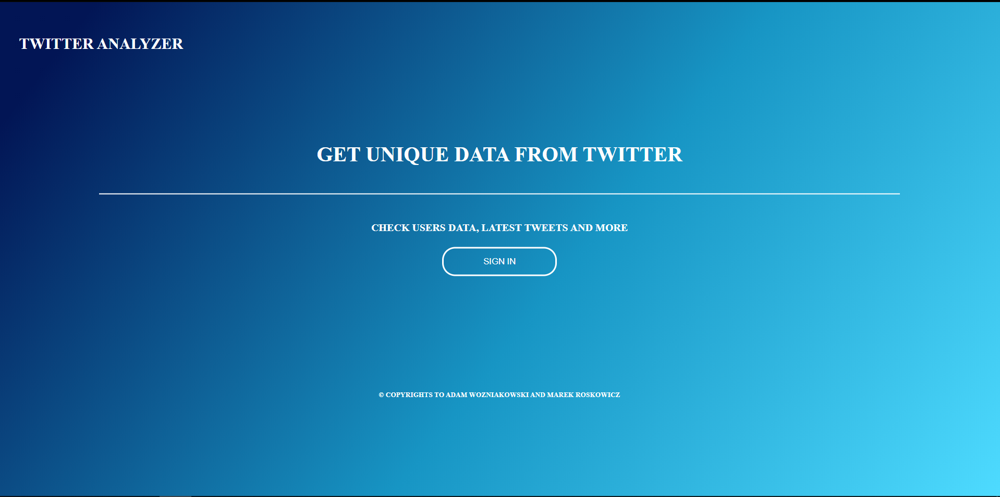

# wat-minwd-i6e3s1

<Header>Autorzy: Adam Wozniakowski 66242 Marek Roskowicz 66183</Header>
<h1>Projekt z laboratorium numer 3 z przedmiotu MINWD</h1>

Zadanie polegalo na pobraniu informacji z Twitter API i zaprezntowanie wynikow w przyjazny, przyjemny dla oka sposob. 
Prezentacja oraz logowanie do konta Twitter-owego odbywa sie poprzez aplikacje webowa. 

Po udanym zalogowaniu sie do apliacji uzytkownikowi przedstawione sa dane:

Aplikacja pozwala zallogowac sie uzytkownikowi tylko i wylacznie z poziomu systemu bedacego localhostem

<ul>
<li>uzyskanie informacji o użytkowniku</li>
<li>pierwszy i ostatni tweet</li>
<li>chmura tagów z ostatnich X tweetów</li>
</ul>

Tokeny dostepowe dla sesji sa przechowywane przez dlugosc trwania sesji czyli do zamkniecia przegladarki. 
Aplkacaj umozliwia rowniez wylogowanie sie.

<h2>Uruchamie aplikacji</h2>

Aby uruchomic aplikacje, w folderze zawierajacym projekt oraz plik pom.xml nalezy wpisac polecenie  <b>mvn clean -D skipTests package spring-boot:run</b>
  
Aplikacja zostala stworzona z uzyciem:

<ul>
<li>TwitterAPI</li>
<li>Spring-boot</li>
<li>HTML, CSS, JavaScript</li>
<li>Biblioteki Twitter4j</li>
</ul>
